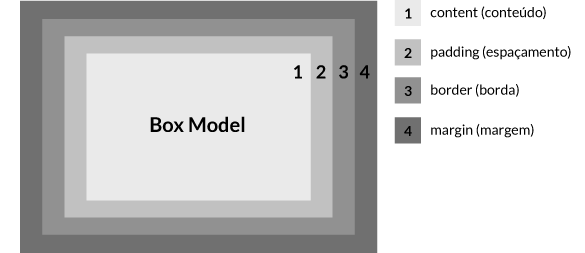

# O Modelo De Caixa

Todo elemento html pode ser entendido como uma caixa com os seguintes elementos:



1. Conteúdo: o conteúdo da caixa, com textos e imagens;
2. Padding(espaçamneto): limpa uma área em torno do conteúdo, o preenchimento é transparente;
3. Border(borda): a fronteira que gira em torno do preenchimento e conteúdo;
4. Margin(margem): limpa uma área fora da fronteira, é transparente.

Exemplo(execute em sua máquina para visualizar):
[exemplo](exemplo.html)

## Largura e altura de um elemento  
- Quando você define as propriedades largura e altura de um elemento com CSS, você apenas definir a largura e altura do conteúdo com o width e height. Para calcular o tamanho total de um elemento, você também deve adicionar espaçamentos, bordas e margens.
- Assim, parar garantirmos que um elemento terá a largura/altura que definimos, precisamos adicionar a seguinte propriedade no elemento:

    `box-sizing: border-box`

- A border-box não é herdade, assim para aplicar a propriedade a todos os elementos usamos o chamado **seletor de estrelas/universal**:

```css
* {
    box-sizing:border-box;
}
```

- Significa dizer que essa propriedade será aplicada à todos os elementos da página.

## Margens cumulativas
- Se temos 2 caixas colocadas lado a lado/horizontalmente com margens laterais x e y respectivamente, a distância entre elas corresponde a x + y;
## Margens colapsadas
- Se temos 2 caixas colocadas uma em cima da outra/empilhadas com margens de cima/baixo x e y respectivamente, a distância entre elas corresponde à maior margem, seja x ou y, a menor por sua vez colapsa;
## Estouro de conteúdo
- Quando definimos uma altura para a caixa mas o conteúdo "estoura/ultrapassa" essa altura, usamos para resolver a seguinte propriedade:

    	overflow: visible(texto visível)/hidden(texto que transbordou é escondido)/auto(aparece uma barra de rolamento para que o usuário desça e visualize o resto do texto)
