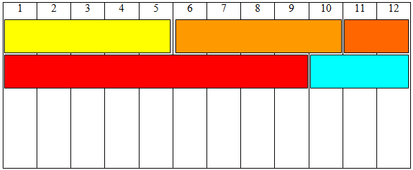

# Design Responsivo
- Surgiu à medida que a navegação em dispositivos móveis tornou-se maior que a em desktops;
- "Qual aparelho precisamos suportar?":todos eles;
- Um site com design responsivo é aquele projeto que adapta seu layout ao ambiente de visualização usando grades fluida e baseadas em proporção(larguras em %), imagens flexíveis e consultas de mídia;
- O layout deve se adaptar ao tamanho do aparelho, como consequência, textos e imagens podem mudar de lugar;

## Layout responsivo do grid de 12 colunas
- É um layout baseado na divisão da páginas em 12 colunas;
- 100% da largura / 12 = 8,33% de largura para cada colunas

- Como observado na imagem, dividimos a tela em 12 grades mas também podemos usar combinações que totalizem 12 colunas de largura no total, como 3|3|3|3, 4|4|4, 6|6, 12, 8|4, etc;
- Também podemos ter grades aninhadas, por exemplo, 8|4, e dentro da grade (8), criamos 4 colunas de largura 2 colunas;

### obs.
- Sempre ao fazer um design responsivo, coloque a seguintes tag no head:

`<meta nome = "viewport" content = "width=device-width,initial-scale=1">`

com isso, a página pega a largura do dispositivo, seja qual for.

Exemplo(execute em sua máquina para visualizar):
[exemplo](exemplo.html)
